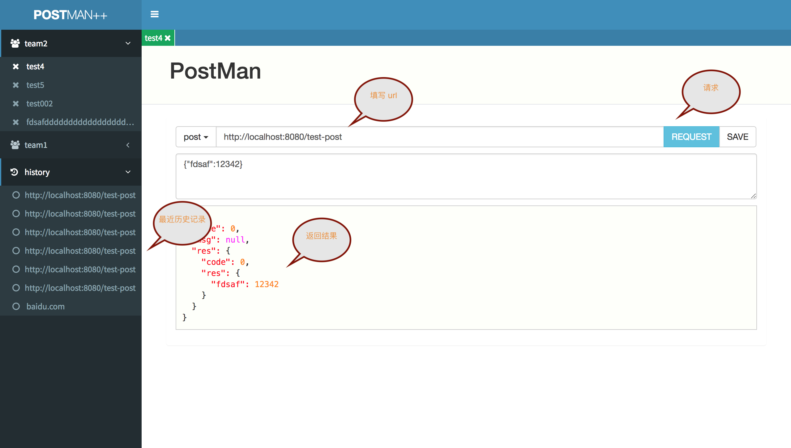
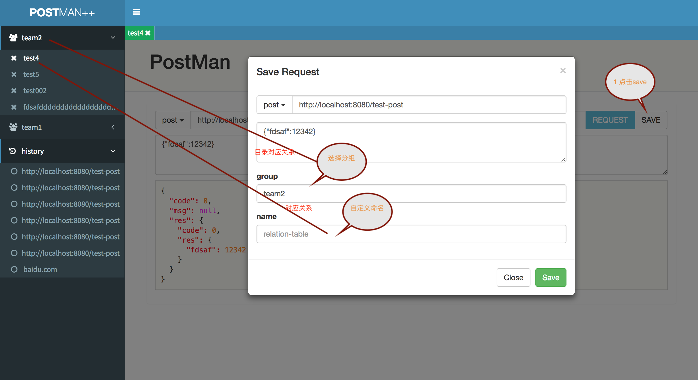

# postman-plus
postman 网页版，用于部署到跳板机这样就可以在本地访问线上接口了

> 小建议： 如果该工具对您有帮助，可以给我们个 star 支持一下 谢谢！ ^_^ ;使用过程中如果有问题或者建议可以给我们提 issue

### 一、特点

#### 1 postman-plus 采用网页方式用户无需安装本地软件
#### 2 支持分组保存请求地址，可以清晰的管理 restful 接口
#### 3 部署到跳板机可以直接在本地请求线上数据

### 二、使用步骤
> 分为两部分，一是基本到使用 二是如何分组保存

#### 1 基本使用

#### 2 分组保存

